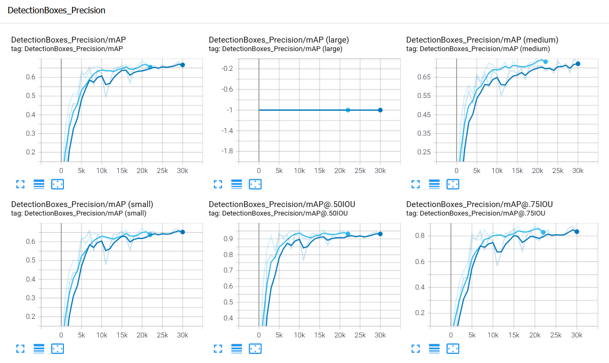
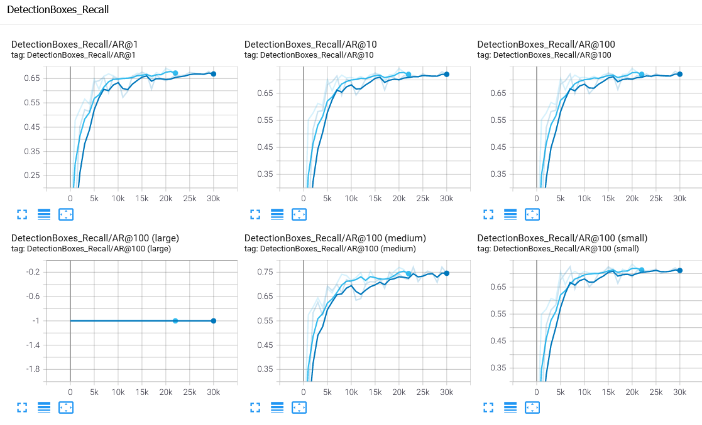
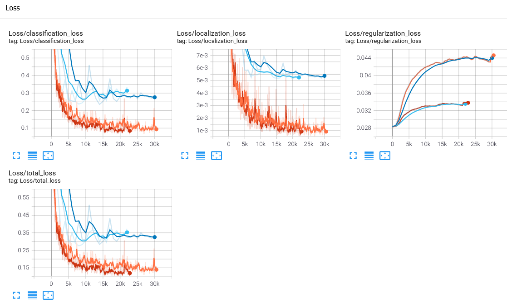
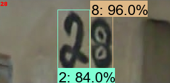
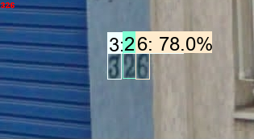
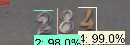
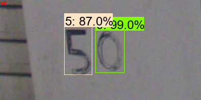
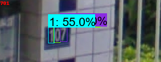

# Steet-Number Digits Detector and Concatenation using Efficient Det D0

<!-- PROJECT SHIELDS -->
<!--
* I'm using markdown "reference style" links for readability.
* Reference links are enclosed in brackets [ ] instead of parentheses ( ).
* See the bottom of this document for the declaration of the reference variables
* for contributors-url, forks-url, etc. This is an optional, concise syntax you may use.
* https://www.markdownguide.org/basic-syntax/#reference-style-links
-->
<!--[![Contributors][contributors-shield]][contributors-url]
[![Forks][forks-shield]][forks-url]
[![Stargazers][stars-shield]][stars-url]
[![Issues][issues-shield]][issues-url]
[![MIT License][license-shield]][license-url]-->


<!-- ABOUT THE PROJECT -->
# About The Project
The Street Number Challenge aims to detect and interpretate the number of houses on images. Therefore, we present a two-stage solution for this challenge. The first stage performs the detection of digits using two different CNN models (EfficientDet D0 and YOLOv4). The second stage concatenates the digits based on a rule based algorithm to provide the predicted number shown on the image.

***Important:*** In this repository only **EfficientDet D0** is covered.

# 1. Built with
## 1.1. Environment
The project was built using:
* Tensorflow 2.3.1
* Tensorflow Object Detection API 2.3.1
* Python 3.6.8

# 2. Workspace Structure
The folder structure of the project can be seen as follows:

```
├── Model_Inference             # Test the trained model and concatenation using the testset 
│   ├── Images                  # Testset images from StreetNumber Dataset
│   ├── Prediction              # Testset images with the predictions from EfficientDet D0
│   ├── Street Number Concatenation.ipynb # Jupyter notebook with digits detections and concatenation
│   ├── prediction.txt          # Predicted Classes from Testset using EfficientDet D0
│   ├── testset_gt.txt          # Ground Truth Clases of the Testset.
├── RealTimeObjectDetection     # Train the model using EfficientDet D0 
│   ├── Tensorflow                      
│       ├── scripts             # Provides a script to convert images and pascal voc annotations to tfrecords.
│       ├── workspace           
│           ├── annotations     # Contains the label maps, and tfrecords
│           ├── images          # Contains the raw images and annotations for each partitions (train, test, validation)
│           ├── models          # Contains the trained model
│           ├── pre-trained-models # Contains the pre-trained model from COCO dataset
│   ├── Tutorial.ipynb          # Jupyer notebook that creates the label map, and tfrecods
├── models                      # Tensorflow Object Detection API folder
└── ...
```
# 4. Experiments
## 4.1. Trainig Phase
During the training phase, two models standout and the metrics evaluated are **mAP, recall, loss**. This can be shown in the following images:




## 4.2. Performance in Testset
### 4.2.1. Detection of Digits
For the testset, we only consider the model with the highest **mAP** which had 0.9190 in the testset and the **AP** for each digits can be shown below: 

| Classes  | AP@0.50  | 
|----------|----------|
|    0     |  1.0000  |                
|    1     |  0.9841  |
|    2     |  0.9662  |
|    3     |  0.8187  |
|    4     |  0.9030  |
|    5     |  0.8292  |
|    6     |  0.9042  | 
|    7     |  0.8666  |
|    8     |  0.9616  |
|    9     |  1.000   |

### 4.2.2. Digits Concatenation
The next step to be evaluated is the **precision, recall, f1-score** of the predicted number after the concatenation step. Using the dataset we obtained the following results:

|            | Micro Avg  | Macro Avg  |  Weighted Avg  | 
|------------|------------|------------|----------------|
| Precision  |    0.92    |    0.66    |      0.71      |
| Recall     |    0.68    |    0.66    |      0.68     |
| F1-Score   |    0.78    |    0.65    |      0.68      |

### 5. Images of the Solution
In this section we provide several example of the system working. The output of the system is written in the top left corner on the image.

   
  

<!-- LICENSE -->
## License

Distributed under the MIT License. See `LICENSE` for more information.

<!-- MARKDOWN LINKS & IMAGES -->
<!-- https://www.markdownguide.org/basic-syntax/#reference-style-links -->
[contributors-shield]: https://img.shields.io/github/contributors/othneildrew/Best-README-Template.svg?style=for-the-badge
[contributors-url]: https://github.com/othneildrew/Best-README-Template/graphs/contributors
[forks-shield]: https://img.shields.io/github/forks/othneildrew/Best-README-Template.svg?style=for-the-badge
[forks-url]: https://github.com/othneildrew/Best-README-Template/network/members
[stars-shield]: https://img.shields.io/github/stars/othneildrew/Best-README-Template.svg?style=for-the-badge
[stars-url]: https://github.com/othneildrew/Best-README-Template/stargazers
[issues-shield]: https://img.shields.io/github/issues/othneildrew/Best-README-Template.svg?style=for-the-badge
[issues-url]: https://github.com/othneildrew/Best-README-Template/issues
[license-shield]: https://img.shields.io/github/license/othneildrew/Best-README-Template.svg?style=for-the-badge
[license-url]: https://github.com/othneildrew/Best-README-Template/blob/master/LICENSE.txt
